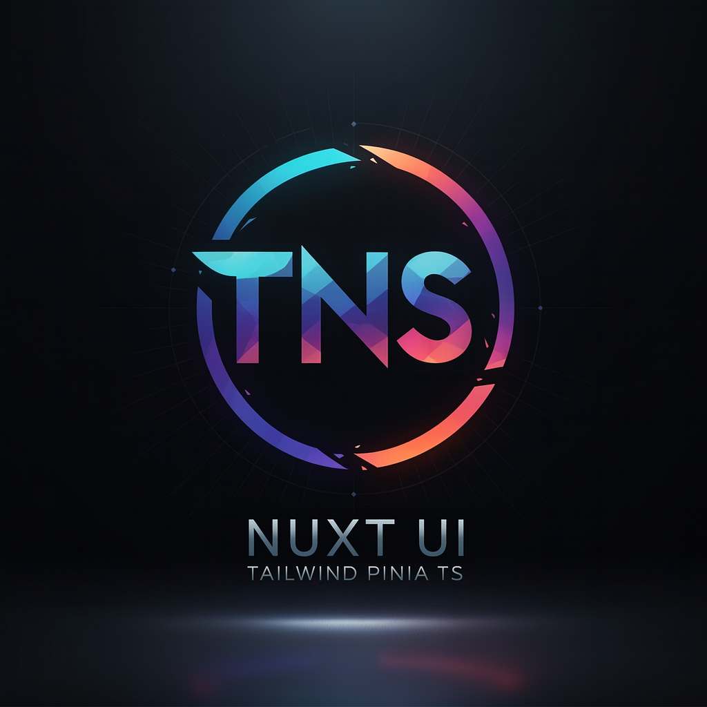

# TJ's Nuxt Starter



Look at the [Nuxt documentation](https://nuxt.com/docs/getting-started/introduction) to learn more.

[Install Bun](https://bun.com/)

## Setup

Make sure to install dependencies:

```bash
bun install
```

## Development Server

Start the development server on `http://localhost:3000`:

```bash
bun run dev
```

## Production

Build the application for production:

```bash
bun run build
```

Locally preview production build:

```bash
bun run preview
```

Check out the [deployment documentation](https://nuxt.com/docs/getting-started/deployment) for more information.
